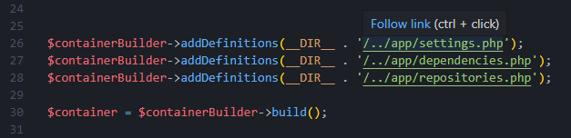

# VS Code PHP File Link




This extension allows to assign links to files declared as strings in the active PHP document.<br />
In case there are multiple matching files, the extension will give you a list to choose from.

<br />

This extension works by fetching list of all workspace files with `supportedExtensions` and comparing them with active document, every time file is opened or changed.

Default cache is set to avoid scaning all workspace dirs every time user is typing and with remote filesystem users in mind.<br />
Cache is cleared when files/dirs are being changed in vscode but I can't detect other users or apps modifying workspace files.<br />
Cache is not refreshing in background, only when is needed.<br />

## 📋 Extension Settings

* `phpFileLink.supportedExtensions`: 
    List of file extensions that can be linked
    ```json
    "default": ["php","ini","log"]
    ```

* `phpFileLink.cacheWorkspaceFiles`: 
    Caching list of workspace files
    ```json
    "default": true
    ```

* `phpFileLink.refreshCacheAfter`: 
    Refreshing cache after x seconds
    ```json
    "default": 120
    ```
## 👋 Special thanks / Credits
Thanks to [Robin Delattre](https://github.com/RobinDev) for PR [Add link to line number](https://github.com/pwarchol/vscode-php-file-link/pull/14).